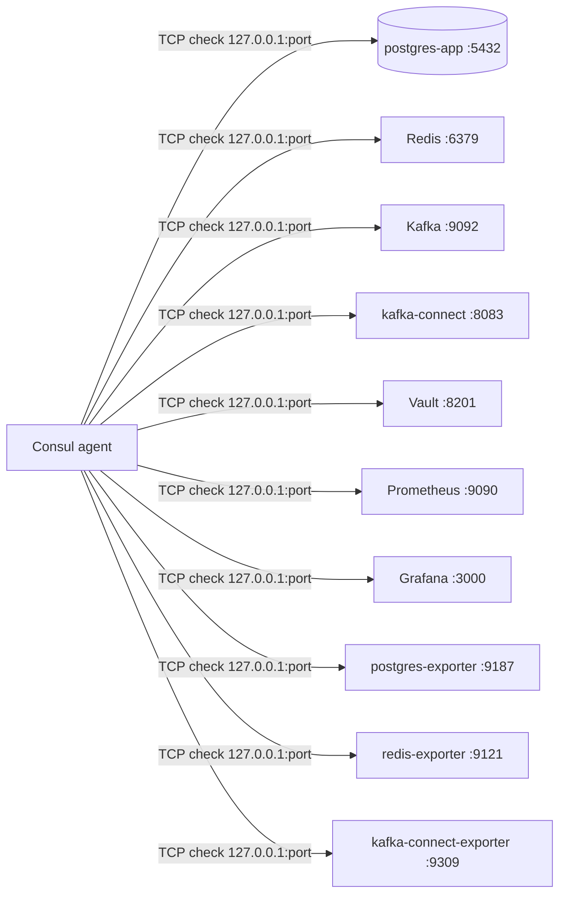

# Consul — Architecture

> Single-node HashiCorp Consul server (service discovery + TCP health checks) for the local stack. API+UI on `127.0.0.1:8500`, DNS `127.0.0.1:8600` (loopback only).

## Overview

The Consul stack is a single Docker container (`hashicorp/consul:1.19`)
inside `aws/consul/`, started locally with `make up` / `make all` (wiring
into the root `aws/` orchestrator is pending). It is a **single server**
(`-bootstrap-expect=1`) in datacenter `dev`, so it acts as agent and server
at once — no client nodes, no ACLs. Its job in this repo is to hold the
service catalog of the sibling stack (Postgres, Redis, Kafka, Vault,
Prometheus, Grafana, exporters) and run a TCP health check for each entry.

## Components

| Container | Image | Host port | Network | Purpose |
| --- | --- | --- | --- | --- |
| consul | `hashicorp/consul:1.19` | 8500 API+UI, 8600 DNS, 8300 RPC, 8301 gossip | host network (loopback) | Agent/server, service catalog, DNS, health checks |

The agent runs with `network_mode: host`, `-bind=127.0.0.1` (gossip) and
`-client=0.0.0.0` (API/DNS/RPC). Data lives in the `consul_data` volume at
`/consul/data`.

## Data flow

Consul itself is scraped by Prometheus (`../prometheus`) at
`127.0.0.1:8500/v1/agent/metrics?format=prometheus`, so the catalog and
health status are observable.

## Service catalog

The catalog is **`scripts/services.txt`** — the single source of truth,
`name:port` per line (`#` comments ignored). Both
`scripts/register-services.sh` (writes `PUT /v1/agent/service/register`) and
`scripts/validate.sh` (checks `/v1/catalog/services`) read it. Current
entries:

| Service | Port |
| --- | --- |
| postgres-app | 5432 |
| redis | 6379 |
| kafka | 9092 |
| kafka-connect | 8083 |
| vault | 8201 |
| prometheus | 9090 |
| grafana | 3000 |
| postgres-exporter | 9187 |
| redis-exporter | 9121 |
| kafka-connect-exporter | 9309 |

### How to register a new service

1. Add `name:port` to `scripts/services.txt`.
2. Run `make register` — every entry is registered with a TCP check on
   `127.0.0.1:<port>` (`interval: 10s`, `timeout: 5s`), tagged `dev`.
3. Run `make validate` to confirm it shows up in the catalog.
4. Keep the README "Registered services" table in sync.

## Networking

- The agent runs on the **host network** (`network_mode: host`): its TCP
  checks reach the sibling services that publish ports on the host, and the
  DNS server answers for `.service.consul` names.
- **Loopback only**: API+UI bind `127.0.0.1:8500`; DNS `127.0.0.1:8600`; RPC
  and gossip on `8300`/`8301`. Nothing is exposed on the LAN. DNS answers
  point to `127.0.0.1`.
- Any registered service resolves as `<name>.service.consul` via
  `127.0.0.1:8600` (e.g. `python3 scripts/dns-query.py redis.service.consul`).

## Configuration and secrets

- `docker-compose.yml` is mounted as the agent's command line: `-server
  -bootstrap-expect=1 -node=local-consul -bind=127.0.0.1 -client=0.0.0.0
  -datacenter=dev -encrypt=${CONSUL_GOSSIP_KEY} -ui`.
- The `.env` file is generated by `scripts/gen-env.sh` from Vault
  `secret/consul/dev` (`CONSUL_GOSSIP_KEY`) via the `consul` AppRole
  (role_id/secret_id in `.secrets/`, gitignored). `.env` is `chmod 600` and
  never committed.
- `scripts/vault-secrets.sh` bootstraps the AppRole (read-only policy on
  `secret/data/consul/*`), saves its creds to `.secrets/`, and stores a fresh
  `consul keygen` key in `secret/consul/dev` (`FORCE=1` rotates it).
- **No ACLs** — a plain single-server dev node; production mirrors this shape
  with the gossip key from AWS Secrets Manager.

## Production reference

The same image (`hashicorp/consul:1.19`) and `-bootstrap-expect=1` run in
production; the gossip key is supplied by AWS Secrets Manager. Keep local
flags in sync with production.

## Related

- [README.md](../README.md) — commands, stack lifecycle and troubleshooting.
- Vault note: [04-infrastructure/consul.md (sca-docs)](https://github.com/sca-templates/sca-docs/blob/main/04-infrastructure/consul.md).
